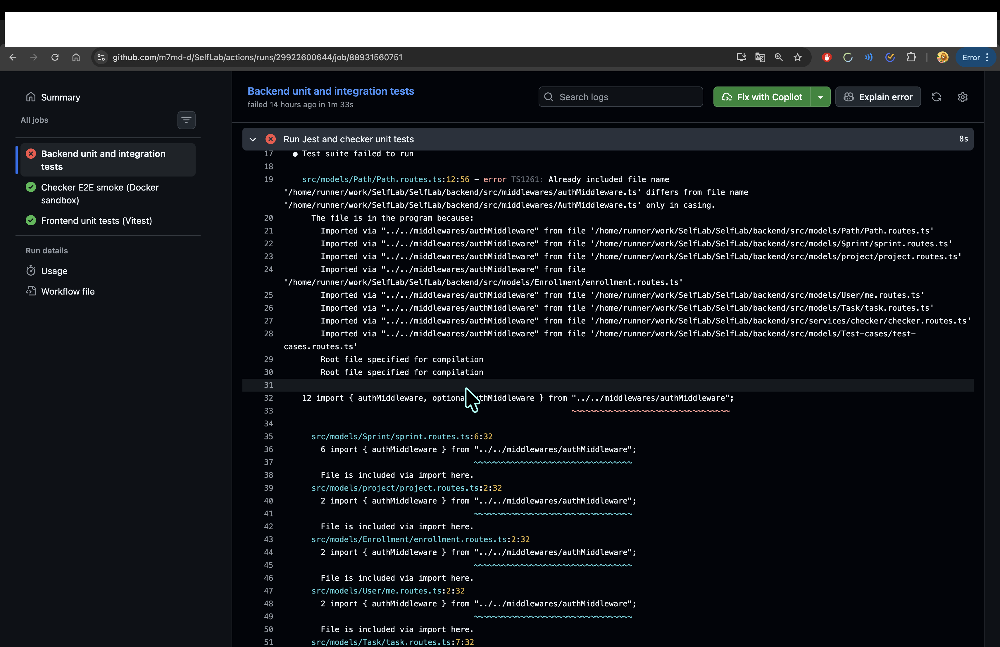
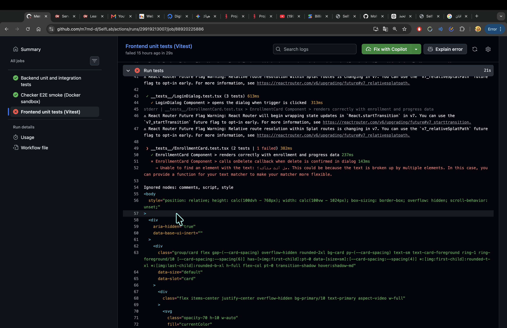

# Testing Evidence and Results

## Continuous Integration Testing

The project uses GitHub Actions to automatically run frontend and backend tests during development.

The following screenshots provide evidence of detected test failures during CI execution.

## Backend Test Failure Evidence

### Issue
Backend Jest tests failed due to a filename casing conflict.

Evidence:

--- 

## Frontend Test Failure Evidence

### Issue
Frontend Vitest tests failed due to component test expectations not matching the rendered output.

Evidence:

---

## Test Summary

| Component | Testing Tool | Result |
|---|---|---|
| Backend API | Jest | Failed initially due to filename casing issue |
| Frontend Components | Vitest | Failed initially due to test expectation issues |
| Path Schema Tests | Jest | Passed |
| Fixed Tests | Jest/Vitest | Passed after corrections |
